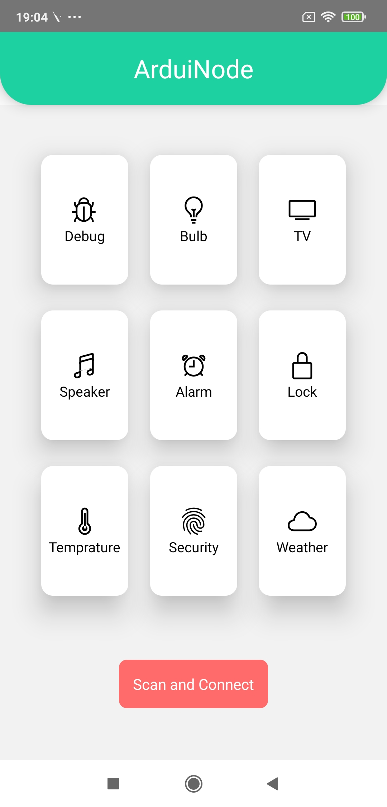
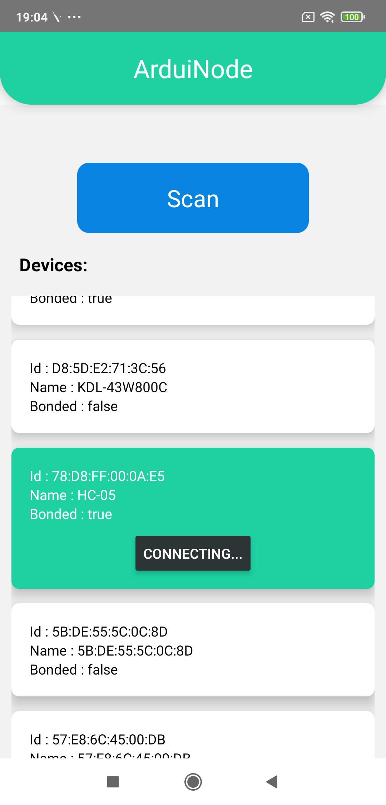
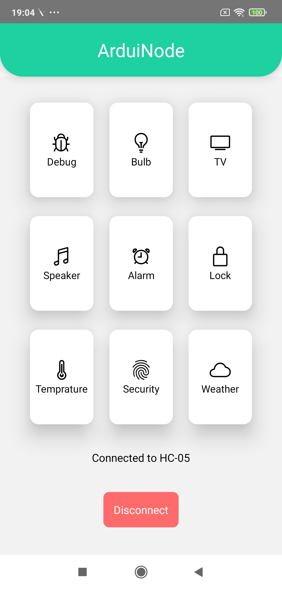
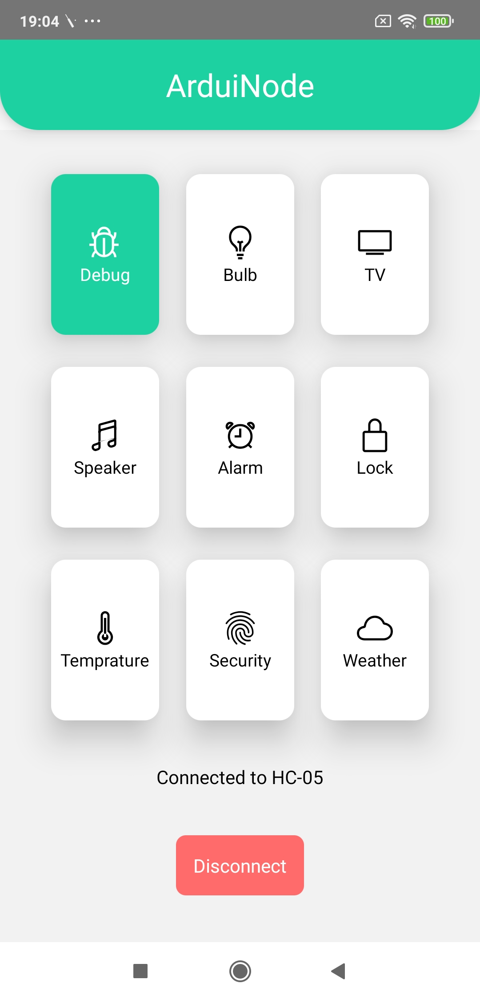

<h1>ArduiNode</h1>

<h3>Description</h3>

    ArduiNode is a mobile application used for controlling a Arduino UNO by connecting to a HC-05. It can be used as an IoT control hub to switch on and off devices from your mobile.

    <b>Design Inspiration from:</b> 
     
    <a href="https://hardikothari.myportfolio.com/iot-smart-space-app-ui-design-elements">IoT Smart Space App</a>

    All the buttons can be configured for different appliances, etc.

<h3>Screenshots:</h3>
 

<h4>Dashboard</h4>

<h4>Scanning and Connecting</h4>

<h4>Connected Dashboard</h4>

<h4>Debug Button Switched On</h4>

